# ☕ Cafe POS System

|                  **Application Cover**                  |     |
| :-----------------------------------------------------: | :-: |
| 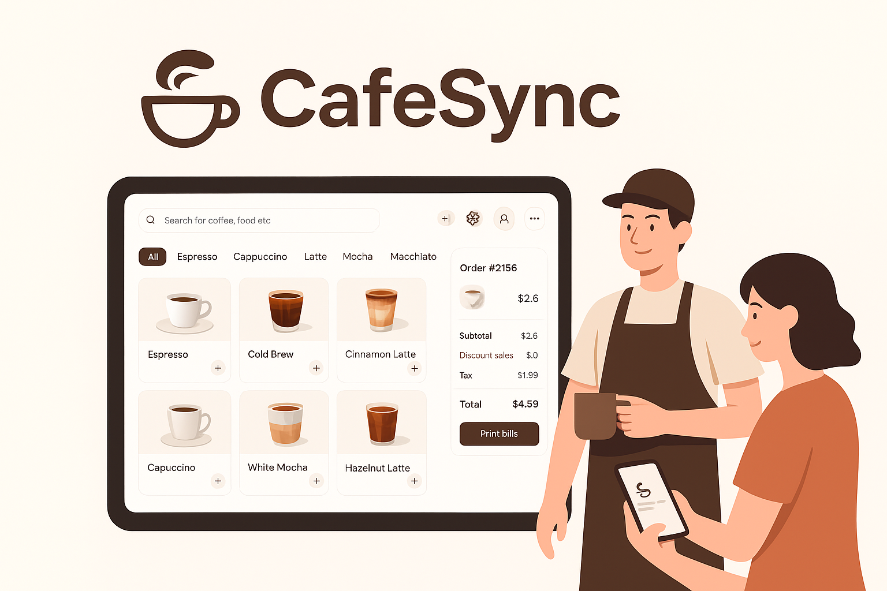 |     |

A modern **Point of Sale (POS) system** for cafés, built with the **MERN stack** and **TypeScript**. This application is designed to streamline cafe operations, offering features like **real-time order management**, detailed dashboard reports, and role-based access to ensure a smooth workflow for all staff.

---

## ✨ Features

- **Real-Time Order Management**: Baristas and cashiers see new orders and status updates instantly, improving communication and service speed.
- **Role-Based Access**: The system differentiates between roles (Admin, Barista, Cashier), granting specific permissions to each user type.
- **Menu & Inventory Management**: Admins can easily add, edit, and delete menu items, categories, and subcategories. They can also manage product availability.
- **Customizable Menu**: Menu items can be organized into categories and subcategories (e.g., Coffee, Tea, Snacks) with support for different sizes and prices.
- **Table & Order Status**: Track the real-time status of tables (occupied, available) and orders (pending, in progress, complete).
- **Comprehensive Reports**: The admin dashboard provides a summary of key metrics, including daily and monthly sales, top-selling items, and staff performance.
- **PDF Generation**: Generate printable sales summaries and order receipts for easy record-keeping and customer convenience.
- **Payment & Discount Management**: Process payments using various methods (e.g., cash, card, mobile wallets) and apply discounts or coupons to orders.
- **Customer Loyalty**: Create and manage customer profiles to track purchase history and offer rewards through a loyalty program.
- **Search & Filtering**: Quickly find orders or products using a search bar and filter reports by date.
- **Staff Management**: Admins can add new staff members and assign roles. They can also activate or deactivate staff accounts as needed.
- **Intuitive UI**: A clean, responsive user interface makes it easy for cashiers to take orders and for staff to navigate the system.
- **Printer Support**: Support for printing kitchen tickets and customer receipts.

---

## 👥 Roles

The application supports three distinct user roles, each with specific permissions to handle their responsibilities efficiently.

### Admin (Owner / Super Admin)

- **User Management**: Add, edit, and manage all staff accounts, assigning them specific roles (Barista, Cashier).
- **Menu Control**: Add, edit, and delete menu items, categories, and subcategories. Manage product availability.
- **Operations Oversight**: View real-time order status and table occupancy.
- **Analytics & Reports**: Access detailed reports on daily/monthly sales, product performance, and staff metrics.

### Barista

- **Order Fulfillment**: View new orders in real time.
- **Status Updates**: Update the status of assigned orders as they are prepared.
- **Menu Suggestions**: Can suggest new menu items for admin approval.

### Cashier

- **Order Creation**: Create new orders, assign them to a table or as a takeaway.
- **Customer Service**: Add items to the order, process payments, and apply discounts.
- **Receipts**: Print order receipts for customers.

---

## 🏗️ Tech Stack

This project is built using a modern, scalable technology stack.

- **Frontend**: **React**, **TypeScript**, **Redux** (for state management), **Vite** (for a fast development environment), **Tailwind CSS** (for styling), and **Lucide React** (for icons).
- **Backend**: **Node.js**, **Express.js**, **TypeScript**.
- **Database**: **MongoDB** (using **Mongoose** for object data modeling).
- **Real-time Communication**: **Socket.io** (for instant updates on orders and tables).
- **Authentication**: **JWT (JSON Web Tokens)**.

---

## 🚀 Installation

Follow these steps to set up the project locally.

### Prerequisites

- Node.js (v18 or higher)
- npm or yarn
- MongoDB (local or cloud-based)

### Backend Setup

1.  Clone the repository:
        `bash
    git clone [https://github.com/your-username/cafe-pos.git](https://github.com/your-username/cafe-pos.git)
    cd cafe-pos/backend
    `
2.  Install dependencies:
        `bash
    npm install
    `
3.  Create a `.env` file in the `backend` directory and add your environment variables:
        `    MONGO_URI=your_mongodb_connection_string
    JWT_SECRET=your_jwt_secret_key
    PORT=5000
   `
4.  Run the server:
        `bash
    npm run dev
    `

### Frontend Setup

1.  Navigate to the frontend directory:
        `bash
    cd ../frontend
    `
2.  Install dependencies:
        `bash
    npm install
    `
3.  Run the client:
        `bash
    npm run dev
    `

The application should now be running on `http://localhost:5173` (or the port specified in your Vite config).

---

### 📄 Sample Receipt

  

## 📸 Screenshots

A visual walkthrough of the Cafe POS System's key features and user interface.

|               **Dashboard & Sales Overview**               |                       **Real-Time Orders**                        |
| :--------------------------------------------------------: | :---------------------------------------------------------------: |
| 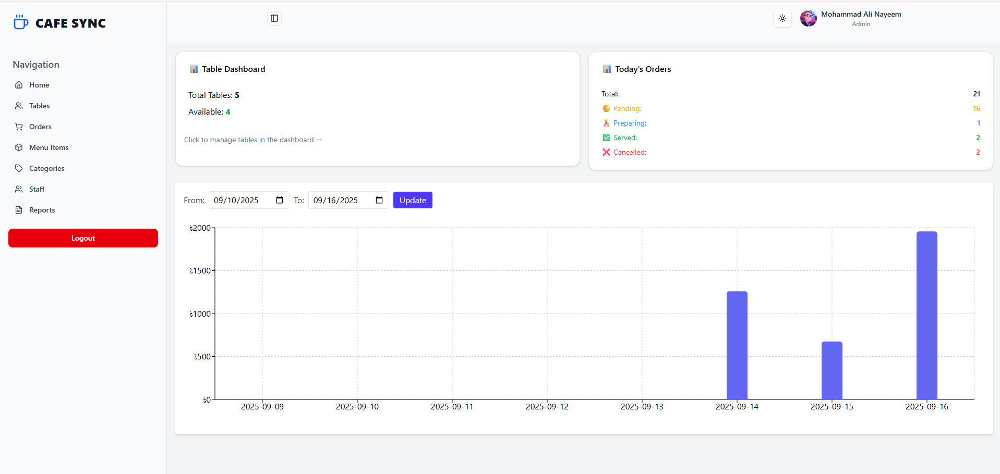 | 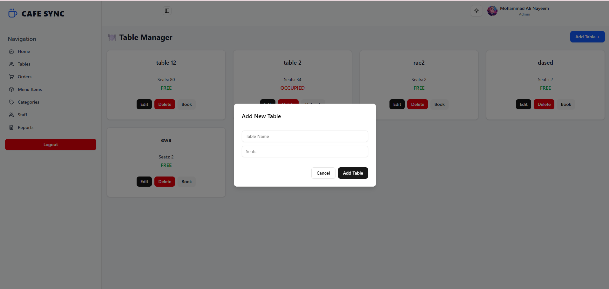 |

|                    **Table Management**                     |                        **Order Creation**                         |
| :---------------------------------------------------------: | :---------------------------------------------------------------: |
| 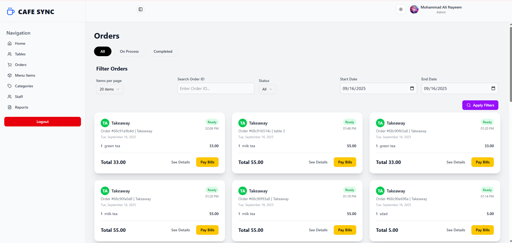 | 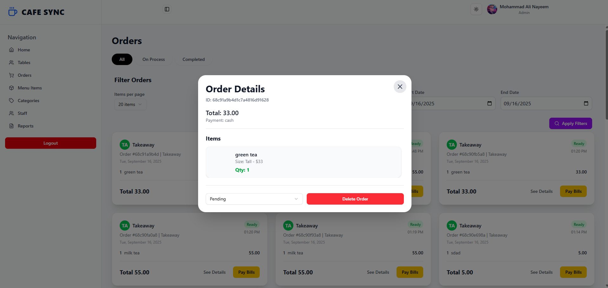 |

|                         **Menu Management**                          |                         **Category Setup**                          |
| :------------------------------------------------------------------: | :-----------------------------------------------------------------: |
| 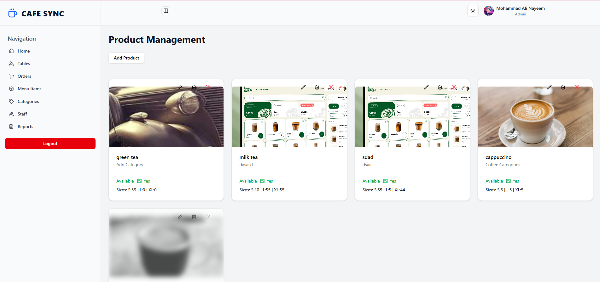 | 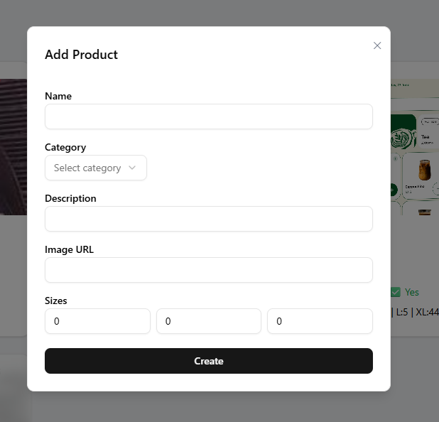 |

|                        **Staff Management**                        |                       **Reports & Analytics**                        |
| :----------------------------------------------------------------: | :------------------------------------------------------------------: |
| 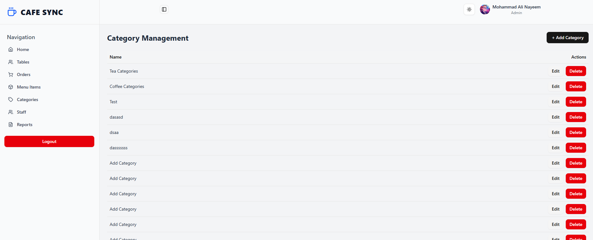 | 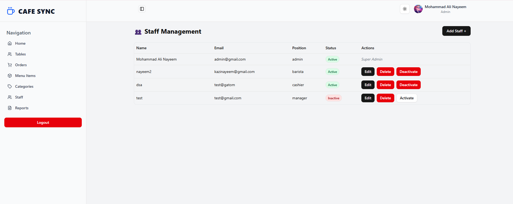 |

|                      **Search Functionality**                      |                           **Staff Permissions View**                           |
| :----------------------------------------------------------------: | :----------------------------------------------------------------------------: |
| 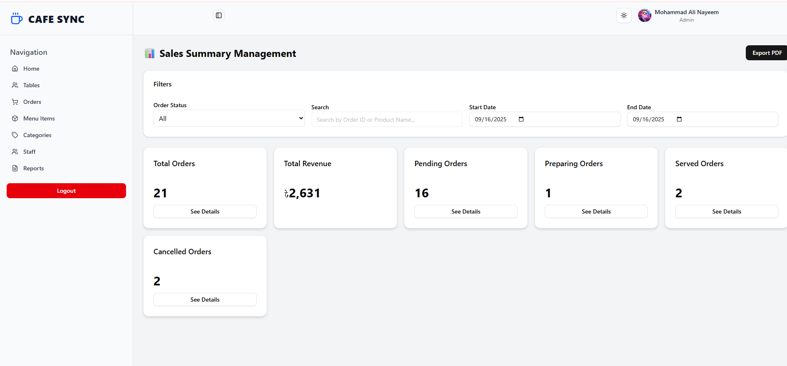 | 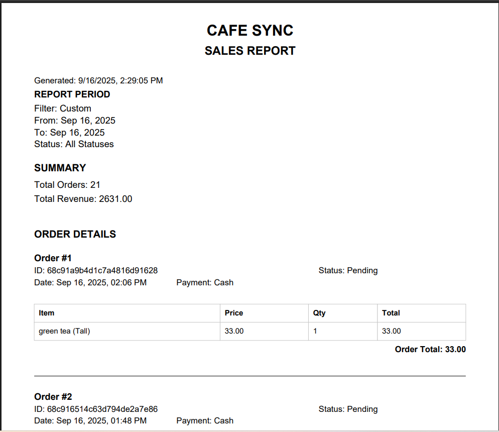 |

|                  **Product Availability Toggles**                  |                         **Detailed Order View**                         |
| :----------------------------------------------------------------: | :---------------------------------------------------------------------: |
| 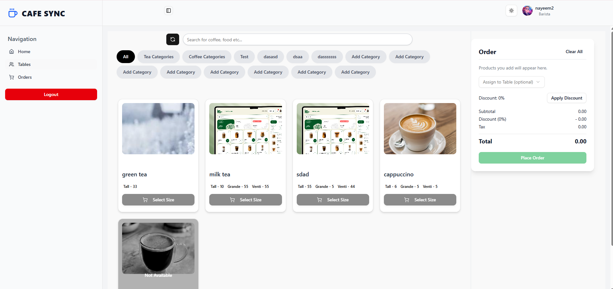 | 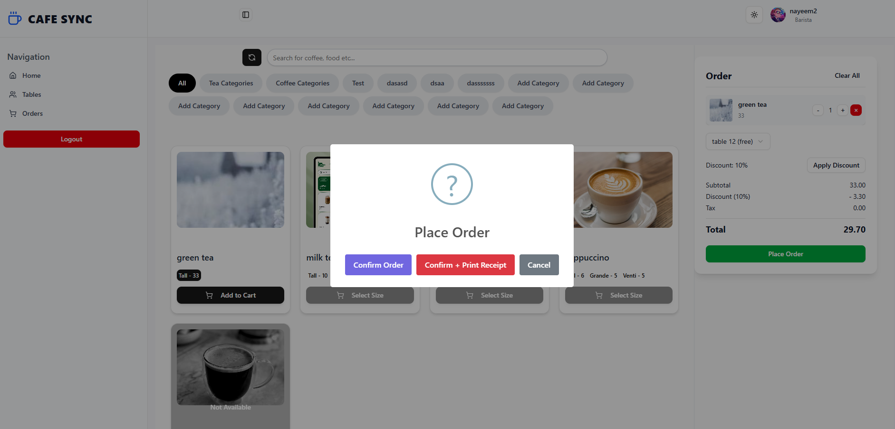 |

|                     **Order Confirmation**                     |                   **PDF Receipt Generation**                    |
| :------------------------------------------------------------: | :-------------------------------------------------------------: |
| 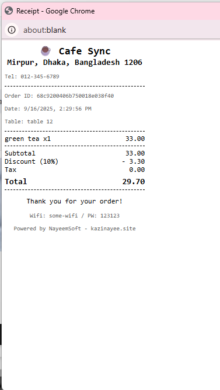 | 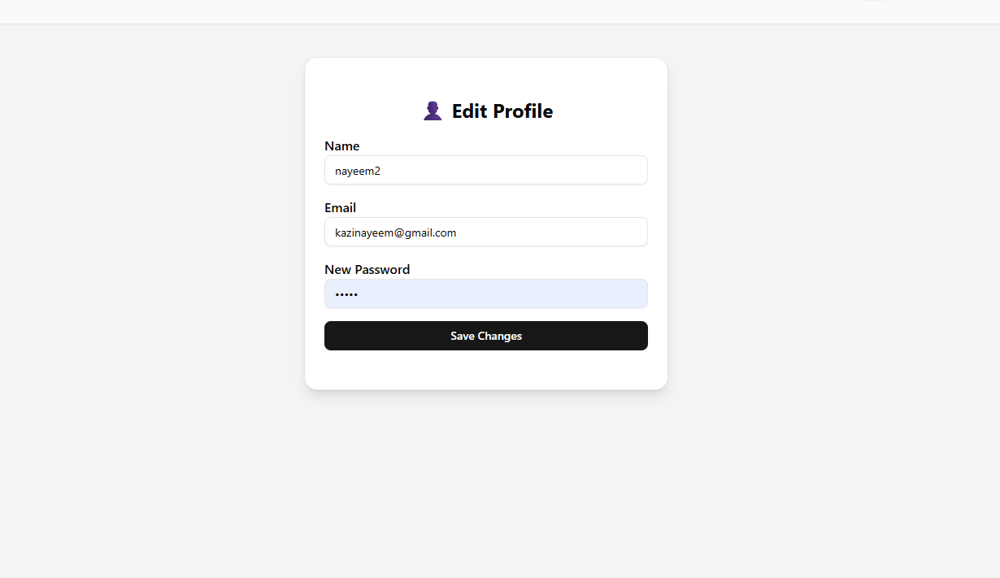 |

## 🤝 Contributing

Contributions are welcome! If you find a bug or have a feature request, please open an issue. For major changes, please fork the repository and create a pull request.

---

## 📄 License

This project is licensed under the MIT License.
