# ☕ Cafe Sync — Production-Grade Cafe POS & Smart QR Ecosystem

<div align="center">
  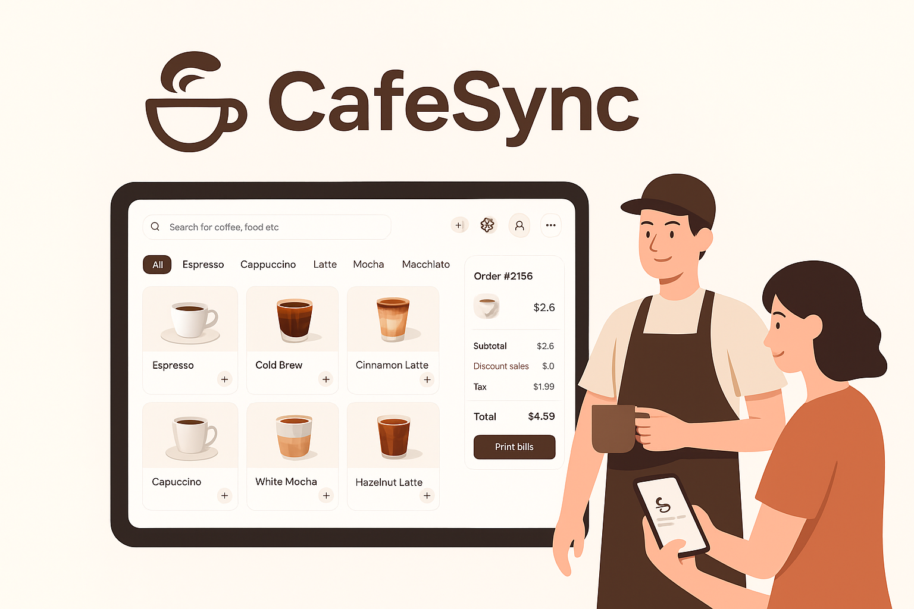

  <p align="center">
    <strong>A modern, enterprise-ready Cafe Point of Sale (POS), Smart Table QR Ordering, Dedicated Kitchen Display System (KDS), and Real-Time Customer Display ecosystem.</strong>
  </p>

  <p align="center">
    
    
    
    
  </p>
</div>

---

## 🎥 Video Preview

<div align="center">
  <a href="https://youtu.be/JgM4OJIKdkY" target="_blank">
    
  </a>
</div>

---

## 🌟 What is Cafe Sync?

**Cafe Sync** is a full-featured Point of Sale (POS) and operations platform built specifically for high-speed specialty cafes, coffee shops, and restaurants. 

It unifies the **cashier register**, **kitchen/barista queue**, **customer mobile ordering**, **in-cafe TV status displays**, **inventory management**, and **CRM loyalty rewards** into a cohesive, zero-latency system powered by WebSockets.

---

## ⚡ System Architecture & Automated Workflow

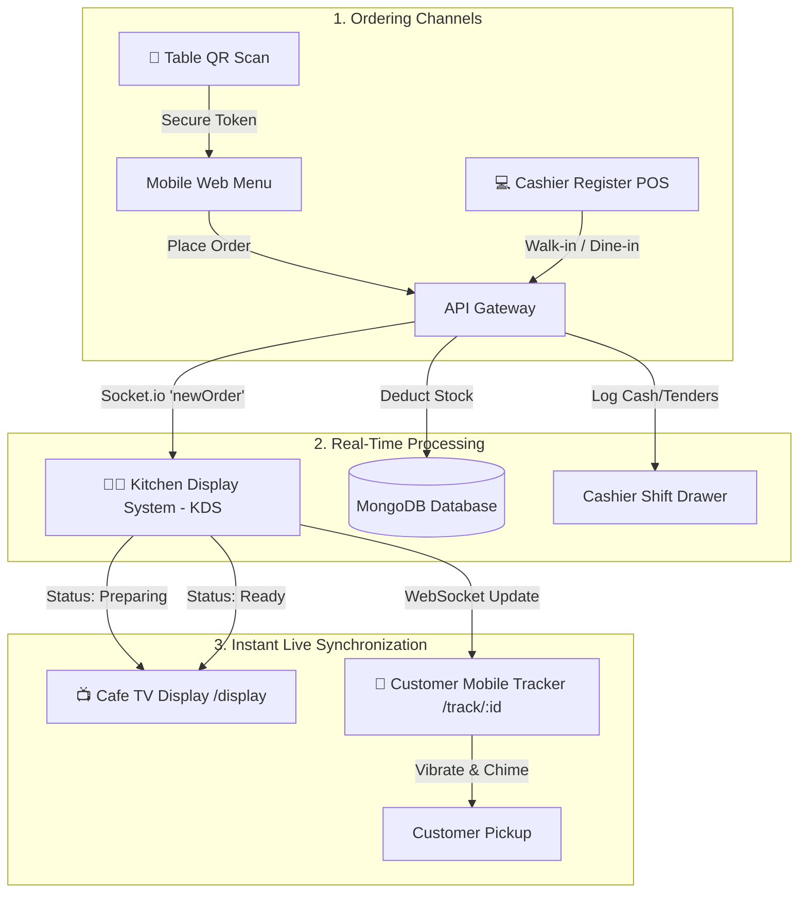
```mermaid
graph TD
    subgraph "1. Ordering Channels"
        A[📱 Table QR Scan] -->|Secure Token| B[Mobile Web Menu]
        B -->|Place Order| C[API Gateway]
        D[💻 Cashier Register POS] -->|Walk-in / Dine-in| C
    end

    subgraph "2. Real-Time Processing"
        C -->|Socket.io 'newOrder'| E[👨‍🍳 Kitchen Display System - KDS]
        C -->|Deduct Stock| F[(MongoDB Database)]
        C -->|Log Cash/Tenders| G[Cashier Shift Drawer]
    end

    subgraph "3. Instant Live Synchronization"
        E -->|Status: Preparing| H[📺 Cafe TV Display /display]
        E -->|Status: Ready| H
        E -->|WebSocket Update| I[📲 Customer Mobile Tracker /track/:id]
        I -->|Vibrate & Chime| J[Customer Pickup]
    end
```

---

## ✨ Core Features & Modules

### 1. ☕ High-Efficiency POS Register
* **Product Modifiers & Sizes**: Support for single-selection (e.g. Milk choice, Sweetness level) and multi-selection (e.g. Extra espresso shots, Flavored syrups, Whipped cream) with real-time price calculations.
* **Per-Item Kitchen Notes**: Cashiers can append special instructions (e.g., *"Extra hot"*, *"Less ice"*).
* **Multi-Tender Split Payments**: Settle single tickets across multiple tenders simultaneously (Cash + Card + bKash + Nagad + Loyalty Points).
* **Customer CRM & Loyalty Attachment**: Quickly attach or register guests at checkout to award points.
* **Thermal Receipt Printing**: Styled PDF & thermal receipts with tax, discounts, and store details.

### 2. 📲 Smart Table QR Ordering (`/order/:qrToken`)
* **Secure Table Token System**: Every table features a unique, tamper-proof cryptographic token (`qrToken`).
* **Mobile-First Customer Web App**: Guests scan their table QR code with their phone camera to browse the menu, customize drinks, and submit orders without app downloads or login friction.
* **Concurrent Table Ordering**: Multiple guests at the same table can order independently under the same table identifier.
* **Guest Cart Caching**: LocalStorage persistence prevents cart loss on accidental reloads or connection drops.

### 3. ⚡ Live Real-Time Customer Order Tracking (`/track/:orderId`)
* **Live Status Progression**: Real-time 5-stage vertical timeline: `Order Received` → `Confirmed` → `Preparing` → `Ready for Pickup` → `Completed`.
* **Zero-Refresh WebSocket Sync**: Screen updates automatically when baristas advance tickets on the KDS.
* **Arrival Celebration**: Plays a sound alert and vibrates mobile devices when orders are **Ready**.

### 4. 📺 Cafe Customer TV Status Display (`/display`)
* **Large Monitor / TV Optimization**: High-contrast, dark-mode board with large readable typography designed for viewing across the cafe.
* **Dual Prominent Boards**:
  * **NOW PREPARING**: Active queue in progress with table identifiers.
  * **READY FOR PICKUP**: Pulsating glowing emerald badges for orders ready for collection.
  * **RECENTLY COMPLETED**: Bottom ticker showing tickets completed in the past 10 minutes.
* **Integrated Controls**: Fullscreen mode toggle and audio chime notification on ready status.

### 5. 👨‍🍳 Dedicated Kitchen Display System (KDS) (`/kitchen`)
* **Live Kanban Lanes**: `New Ticket` (Pending) → `In Preparation` (Preparing) → `Ready to Serve` (Ready).
* **Elapsed Timers & Overdue Warnings**: Tracks preparation minutes with urgency alerts (yellow > 10m, red > 15m).
* **Ticket Source Badges**: Clearly distinguishes **`📱 QR ORDER`** tickets from cashier walk-in orders.

### 6. 👥 Customer CRM & Loyalty Program
* **Customer Profiles**: Tracks lifetime spend, visit count, phone numbers, emails, and customer preferences.
* **Loyalty Points System**: Earn points automatically from purchases and redeem them at checkout for discounts.
* **Audit Ledger**: Complete transaction history with manager override tools.

### 7. 📦 Real Inventory & Stock Management
* **Automated Stock Deduction**: Deducts ingredient and item stock quantities upon sales.
* **Movement Audit Logs**: Records stock-in, stock-out, damage, spoilage, and adjustments.
* **Low Stock & Out-of-Stock Alerts**: Visual threshold warnings across the POS register and inventory dashboard.

### 8. 💰 Cashier Shift & Cash Drawer Balancing
* **Opening Float Entry**: Cashiers record physical cash at shift start.
* **Cash Drawer Tracking**: Records Cash Drops (safe transfers), Cash In (add float), and Cash Out (petty cash).
* **End-of-Shift Balancing**: Compares expected drawer cash against counted cash, highlighting discrepancies.

### 9. 🪑 Floor Plan, Tables & Reservations
* **Sectioned Floor Plan**: Manage tables across `Main Hall`, `Terrace`, `Rooftop`, and `VIP Lounge`.
* **Table QR Management**: Single QR download (PNG), link copying, and **Bulk Printable QR Sheets**.
* **Table Reservations**: Bookings with guest count, date/time, customer contact, and status lifecycle.

### 10. 📊 Reports & Financial Analytics
* **Sales Summary**: Gross sales, net revenue, total tickets, and Average Order Value (AOV).
* **Date Range Filters**: Presets for *Today*, *Yesterday*, *Last 7 Days*, *This Month*, and custom ranges.
* **7-Day Trend Charts**: Revenue and order volume trend charts powered by Recharts.
* **PDF Sales Report Export**: Download formatted sales audit summaries.

---

## 👥 Role & Permissions Matrix

| Role | POS Register | Kitchen KDS | Floor Plan & QR | Inventory | CRM & Loyalty | Shifts & Drawer | Reports | Staff & Settings |
| :--- | :---: | :---: | :---: | :---: | :---: | :---: | :---: | :---: |
| **Admin / Owner** | ✅ | ✅ | ✅ | ✅ | ✅ | ✅ | ✅ | ✅ |
| **Manager** | ✅ | ✅ | ✅ | ✅ | ✅ | ✅ | ✅ | ❌ |
| **Cashier** | ✅ | ❌ | ✅ | ❌ | ✅ | ✅ | ❌ | ❌ |
| **Barista** | ❌ | ✅ | ❌ | ❌ | ❌ | ❌ | ❌ | ❌ |
| **Waiter** | ❌ | ❌ | ✅ | ❌ | ❌ | ❌ | ❌ | ❌ |

> **Security Note:** All sensitive endpoints strictly enforce JWT authentication and database-level permission middleware (`checkPermission`).

---

## 🏗️ Technology Stack

* **Frontend**: React 19, TypeScript, Redux Toolkit, RTK Query, Vite, Tailwind CSS v4, Lucide React, Recharts, `qrcode.react`, jsPDF.
* **Backend**: Node.js, Express.js, TypeScript.
* **Database**: MongoDB (Mongoose ODM).
* **Real-time Engine**: Socket.io (bidirectional WebSocket coordination).
* **Authentication**: JWT (JSON Web Tokens) with role-based access control.

---

## 🚀 Getting Started

### Prerequisites
* Node.js (v18 or higher)
* npm or yarn
* MongoDB instance (local or MongoDB Atlas)

### 1. Backend Setup
```bash
cd server
npm install
```

Create a `.env` file in the `server` directory:
```env
PORT=5000
MONGO_URI=mongodb://localhost:27017/cafe-sync
JWT_SECRET=your_super_secret_jwt_key
CLIENT_URL=http://localhost:5173
```

Start the backend server:
```bash
npm run dev
```

### 2. Frontend Setup
```bash
cd ../client
npm install
```

Create a `.env` file in the `client` directory:
```env
VITE_API_URL=http://localhost:5000
```

Start the Vite development server:
```bash
npm run dev
```

Open `http://localhost:5173` in your browser.

---

## 🗺️ Key Application Routes

| Route | Purpose | Audience |
| :--- | :--- | :--- |
| `/` | Landing Page & Portal Launcher | General |
| `/login` | Staff Authentication | Staff |
| `/order/:qrToken` | **Smart Table QR Mobile Ordering** | Customers |
| `/track/:orderId` | **Live Customer Order Tracking** | Customers |
| `/display` | **Cafe TV / Monitor Order Status Display** | Customers / In-store |
| `/menu` | Public Digital QR Menu | Customers |
| `/kitchen` | **Dedicated Kitchen Display System (KDS)** | Kitchen / Baristas |
| `/dashboard` | Main POS Terminal & Register | Cashiers / Staff |
| `/dashboard/tables` | Table Management & QR Code Generator | Managers / Admins |
| `/dashboard/orders` | Orders Explorer, Drawer & Refunds | Managers / Cashiers |
| `/dashboard/customers` | Customer CRM & Loyalty Ledger | Managers / Admins |
| `/dashboard/inventory` | Real Stock Levels & Movement Logs | Managers / Admins |
| `/dashboard/shifts` | Cashier Shift & Cash Drawer Balancing | Cashiers / Managers |
| `/dashboard/reports` | Sales Analytics & PDF Export | Admins / Owners |
| `/dashboard/settings` | Business Profile, Taxes, RBAC Matrix | Admins |

---

## 📸 Screenshots

| **Dashboard & Operational KPIs** | **POS Register & Ticket Cart** |
| :---: | :---: |
| 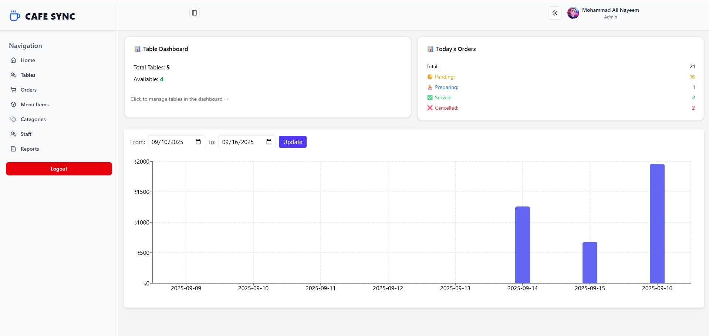 | 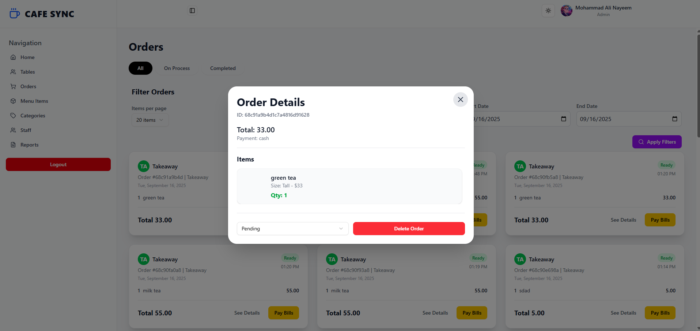 |

| **Kitchen Display System (KDS)** | **Table Management & Floor Plan** |
| :---: | :---: |
| 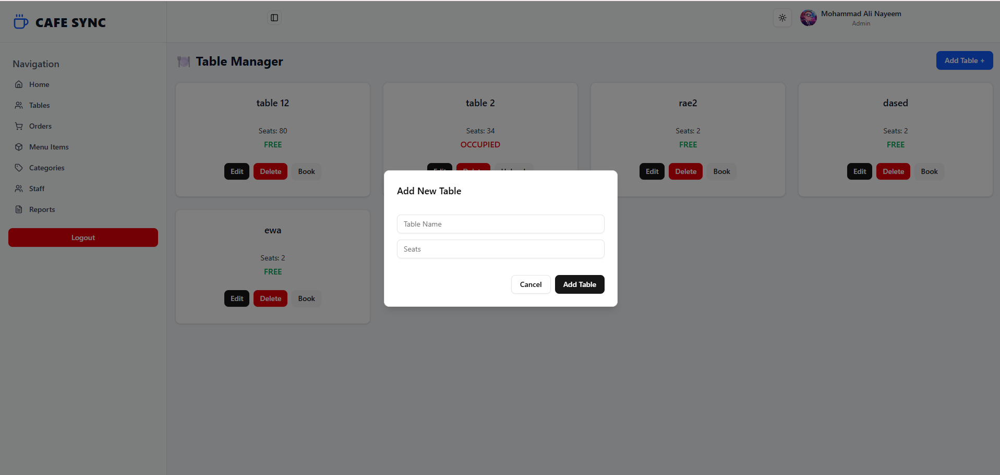 | 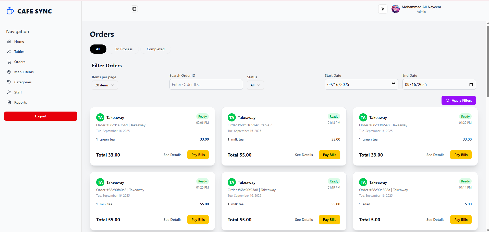 |

| **Catalog & Product Modifiers** | **Category Setup** |
| :---: | :---: |
| 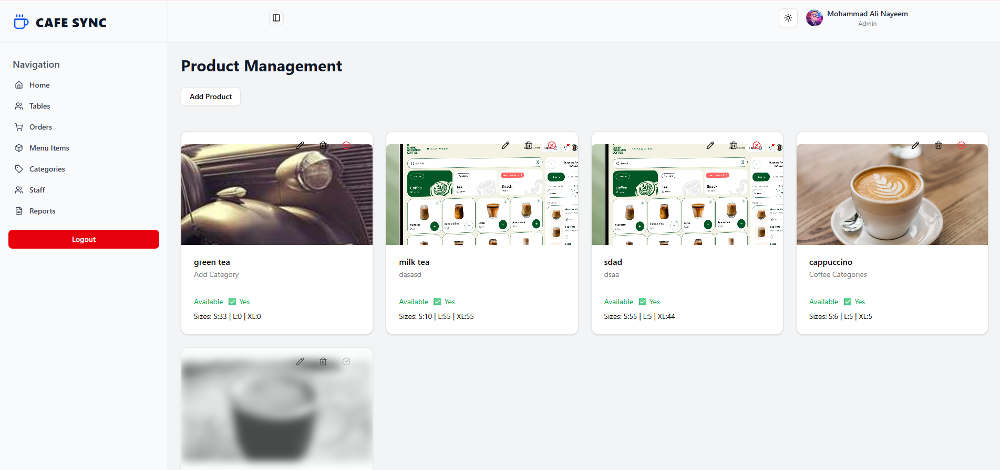 | 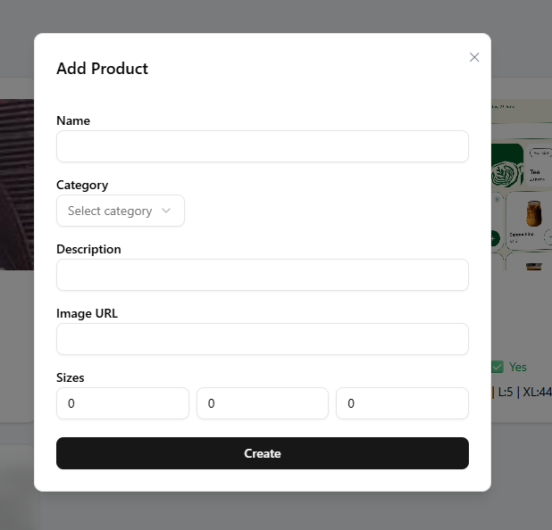 |

| **Staff Directory & Permissions** | **Financial Reports & Analytics** |
| :---: | :---: |
| 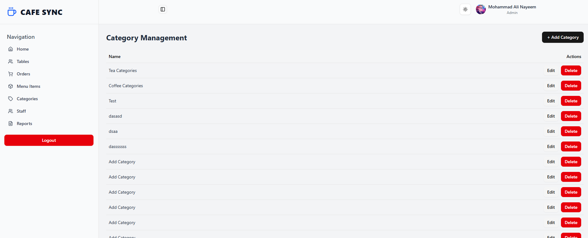 | 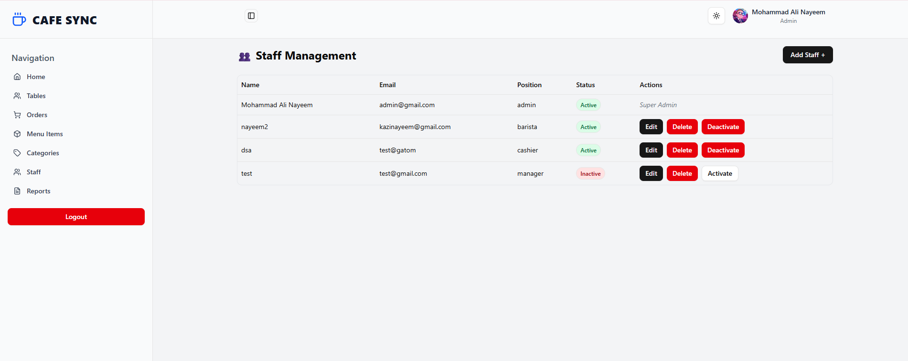 |

| **Search & Filtering Engine** | **Role-Based Access Control** |
| :---: | :---: |
| 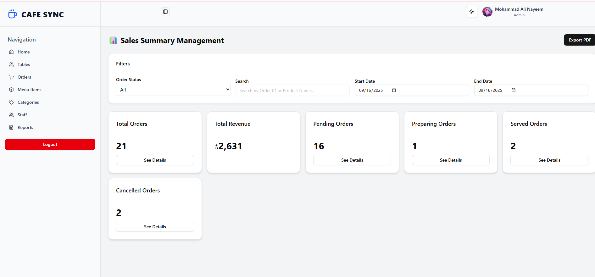 | 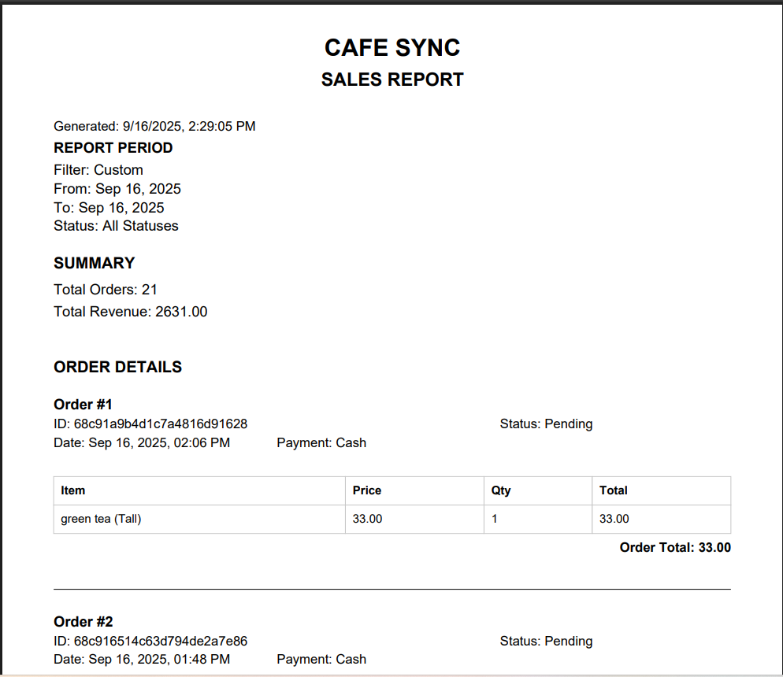 |

| **Real Inventory & Stock Toggles** | **Order Details Drawer & Split Tenders** |
| :---: | :---: |
| 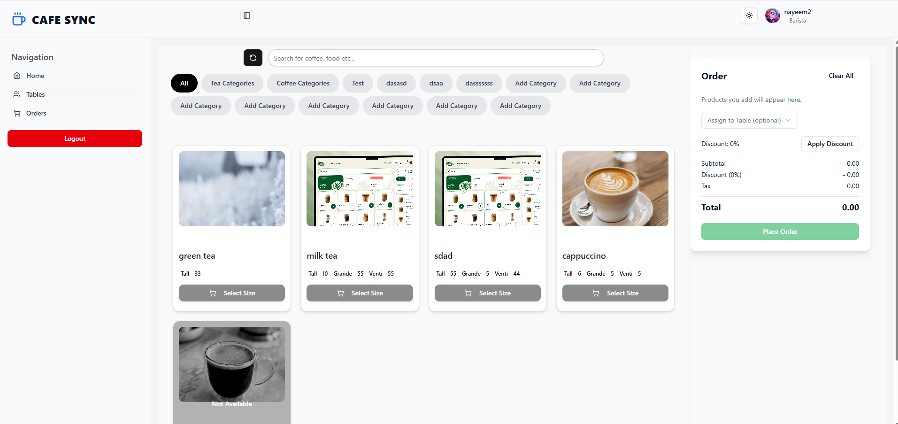 | 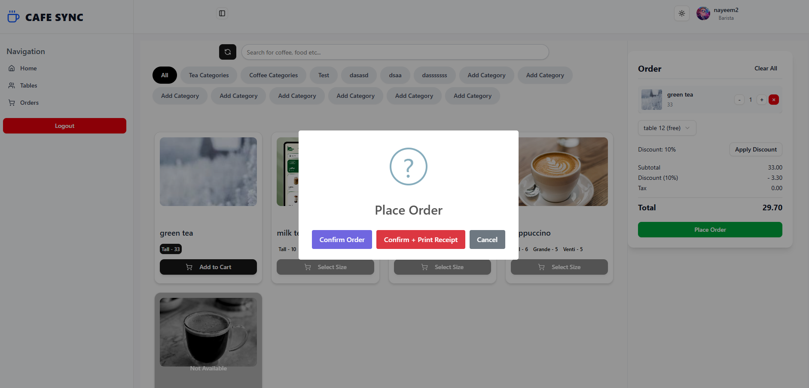 |

| **Order Confirmation & Status** | **PDF Thermal Receipt Generation** |
| :---: | :---: |
| 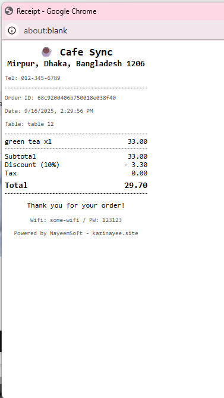 | 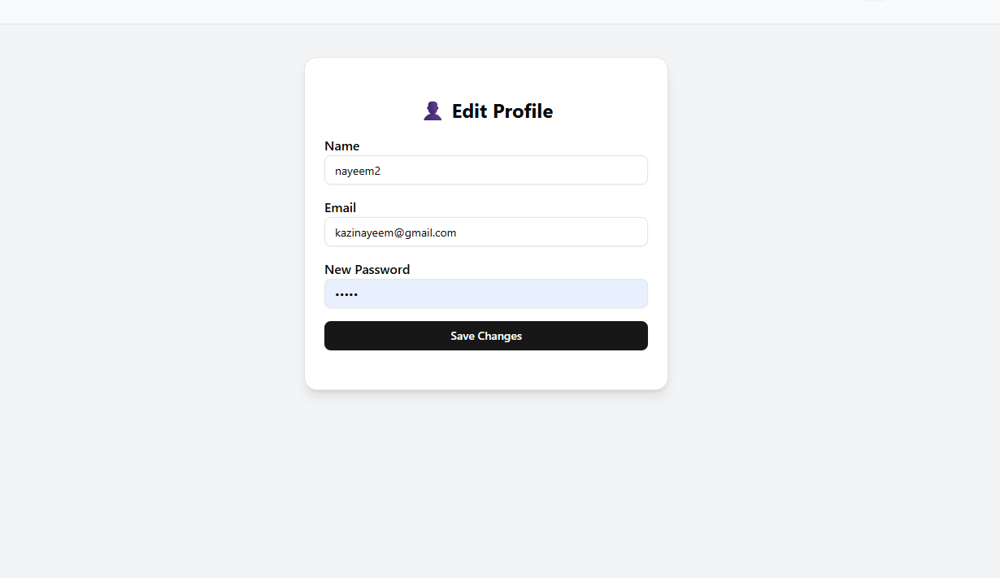 |

---

## 🤝 Contributing

Contributions, issues, and feature requests are welcome! Feel free to open a ticket or submit a pull request.

---

## 📄 License

This project is licensed under the **MIT License**.
