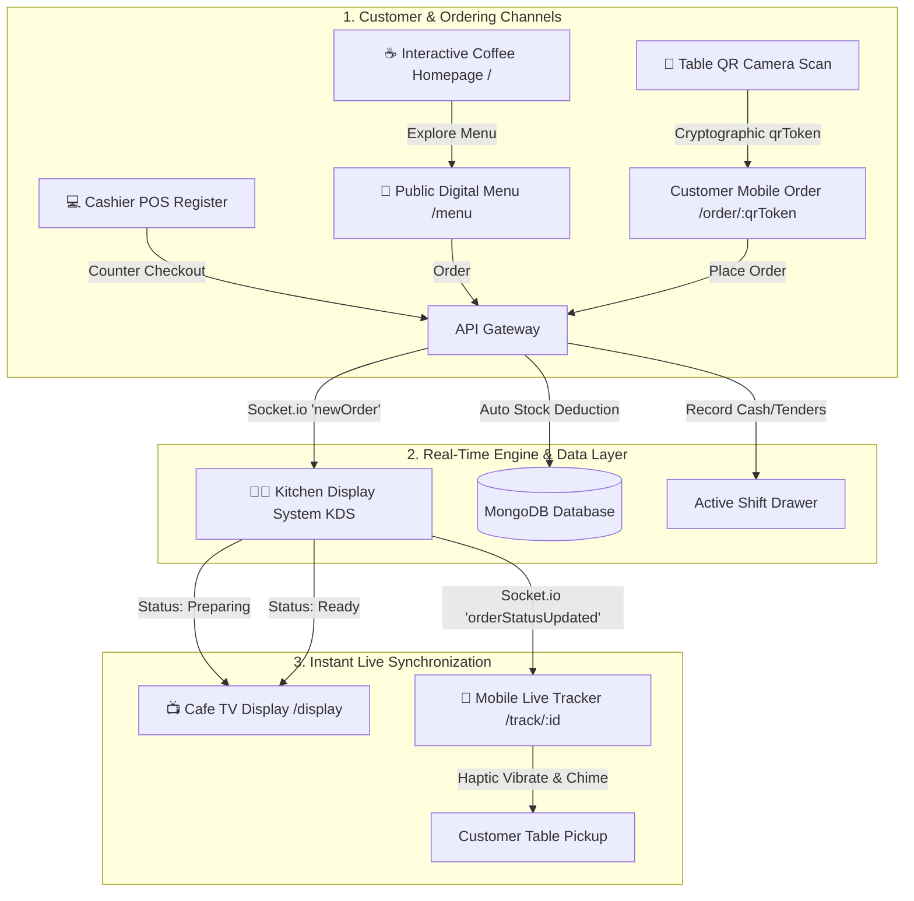

# ☕ Cafe Sync — Specialty Coffee Shop & Smart Cafe POS Ecosystem

<div align="center">
  

  <p align="center">
    <strong>An immersive, production-grade Specialty Coffee Shop Web Experience, Smart Table QR Ordering System, Dedicated Kitchen Display System (KDS), Real-Time TV Display, and Multi-Tender POS Ecosystem.</strong>
  </p>

  <p align="center">
    
    
    
    
  </p>
</div>

---

## 🎥 Video Preview

<div align="center">
  <a href="https://youtu.be/JgM4OJIKdkY" target="_blank">
    
  </a>
</div>

---

## 🌟 What is Cafe Sync?

**Cafe Sync** is a full-scale restaurant and coffee shop platform built specifically for high-speed specialty cafes. It bridges the customer front-of-house experience with back-of-house operations into a zero-latency, real-time ecosystem powered by WebSockets.

---

## ⚡ System Architecture & Automated Workflow


```mermaid
graph TD
    subgraph "1. Customer & Ordering Channels"
        A[☕ Interactive Coffee Homepage /] -->|Explore Menu| B[📱 Public Digital Menu /menu]
        C[📱 Table QR Camera Scan] -->|Cryptographic qrToken| D[Customer Mobile Order /order/:qrToken]
        E[💻 Cashier POS Register] -->|Counter Checkout| F[API Gateway]
        B -->|Order| F
        D -->|Place Order| F
    end

    subgraph "2. Real-Time Engine & Data Layer"
        F -->|Socket.io 'newOrder'| G[👨‍🍳 Kitchen Display System KDS]
        F -->|Auto Stock Deduction| H[(MongoDB Database)]
        F -->|Record Cash/Tenders| I[Active Shift Drawer]
    end

    subgraph "3. Instant Live Synchronization"
        G -->|Status: Preparing| J[📺 Cafe TV Display /display]
        G -->|Status: Ready| J
        G -->|Socket.io 'orderStatusUpdated'| K[📲 Mobile Live Tracker /track/:id]
        K -->|Haptic Vibrate & Chime| L[Customer Table Pickup]
    end
```

---

## ✨ Key Feature Highlights

### 1. ☕ Interactive Coffee Shop Homepage (`/`)
* **Interactive Vector Coffee Scene**: Handcrafted SVG/CSS coffee cup with dynamic espresso crema, silky milk pouring stream, blooming latte art, 4 organic wispy steam trails, and mouse parallax depth.
* **Interactive Brew Stage Controls**: Allows customers to explore brewing steps (`Auto Brew`, `Espresso`, `Milk Pour`, `Latte Art`).
* **Specialty Menu Preview**: Live database product showcase with origin notes, roast profiles, and direct ordering links.
* **Storytelling Step Flow**: 4-stage guide (*"From our counter to your table"*).

### 2. 📲 Smart Table QR Ordering (`/order/:qrToken`)
* **Unique Cryptographic Table Tokens**: Every table in the cafe features its own tamper-proof QR code.
* **Frictionless Mobile Ordering**: Guests scan from their phone camera to browse the menu, customize drinks, choose milk options, add barista notes, and place orders directly without app installation.
* **Persistent Cart**: Local storage cart preservation ensures orders are never lost during accidental page reloads.

### 3. ⚡ Live Real-Time Customer Order Tracking (`/track/:orderId`)
* **Live Status Progression**: Real-time 4-stage visual timeline: `Order Received` → `Brewing / Preparing` → `Ready for Pickup` → `Completed`.
* **Zero-Refresh WebSocket Sync**: Updates instantly when kitchen baristas change ticket statuses on the KDS.
* **Sound & Haptic Alerts**: Plays audio chimes and triggers device vibration when orders are marked **Ready**.

### 4. 👨‍🍳 Dedicated Kitchen Display System (KDS) (`/dashboard/kitchen`)
* **Status-Driven Kanban Board**: Color-coded lanes for `New Ticket` (Blue), `In Preparation` (Orange), `Ready to Serve` (Green), and `Completed` (Muted Slate).
* **Readable Ticket Tokens**: Extra-large bold token numbers (`#A101`), source pills (`📱 QR ORDER` vs `POS`), quantity counters, modifiers, and special kitchen notes.
* **Preparation Timers & Warnings**: Elapsed minute counters with urgency warnings for overdue tickets.
* **Responsive Mobile/Tablet Tabs**: Quick filter tabs on mobile viewports.
* **Dedicated Security Endpoint**: Powered by `GET /api/orders/kds` with `view_kds` permission.

### 5. 📺 Cafe Customer TV Status Display (`/display`)
* **High-Visibility Monitor Display**: Designed for in-cafe wall monitors and TV screens.
* **Split Real-Time Boards**:
  * **NOW PREPARING**: Live brewing queue with table identifiers.
  * **READY FOR PICKUP**: Pulsating glowing emerald badges for orders ready for collection.
  * **RECENTLY COMPLETED**: Bottom ticker showing recently served orders.

### 6. 💻 High-Efficiency Staff POS Register (`/dashboard`)
* **Active Ticket Cart**: Size selection, modifiers, customer loyalty attachment, discount calculator, and VAT breakdown.
* **Order Confirmation Dialog**: Immediate checkmark confirmation with Order #, estimated prep time, live status steps, and receipt printing.
* **Multi-Tender Split Payments**: Settle tickets across multiple payment methods simultaneously (Cash, Card, bKash, Nagad, Loyalty points).
* **Thermal Receipt Printing**: Instant print-ready receipts with custom store headers, footer notes, and item breakdowns.

### 7. 📋 Orders & Sales History (`/dashboard/orders`)
* **Responsive Table & Mobile Cards**: Wide desktop table automatically transforms into dense touch-friendly cards on smaller screens.
* **Order Detail Drawer**: Includes a live timestamped preparation timeline, tender details, and status advancement controls.
* **Refund & Cancellation Engine**: Process full or partial refunds with audit logs.

### 8. 👥 CRM, Inventory, Shifts & Floor Plan
* **Customer CRM & Loyalty**: Automated loyalty point accrual and redemption at checkout.
* **Real Inventory Management**: Automatic stock deduction on sales with threshold alerts.
* **Cashier Shift Balancing**: Opening float, cash in/out logs, expected vs actual cash balancing.
* **Floor Plan & Table Management**: Interactive table status indicators (`free`, `occupied`, `reserved`) with bulk printable QR sheets.

---

## 👥 Role & Permissions Matrix (RBAC)

| Role | POS Register | Kitchen KDS | Floor Plan & QR | Inventory | CRM & Loyalty | Shifts & Drawer | Reports | Staff & Settings |
| :--- | :---: | :---: | :---: | :---: | :---: | :---: | :---: | :---: |
| **Admin / Owner** | ✅ | ✅ | ✅ | ✅ | ✅ | ✅ | ✅ | ✅ |
| **Manager** | ✅ | ✅ | ✅ | ✅ | ✅ | ✅ | ✅ | ❌ |
| **Cashier** | ✅ | ❌ | ✅ | ❌ | ✅ | ✅ | ❌ | ❌ |
| **Barista** | ❌ | ✅ | ❌ | ❌ | ❌ | ❌ | ❌ | ❌ |
| **Staff** | ✅ | ✅ | ✅ | ❌ | ❌ | ✅ | ❌ | ❌ |

---

## 🏗️ Technology Stack

* **Frontend**: React 19, TypeScript, Redux Toolkit, RTK Query, Vite, Tailwind CSS v4, Lucide React, Recharts, `qrcode.react`, jsPDF.
* **Backend**: Node.js, Express.js, TypeScript.
* **Database**: MongoDB with Mongoose ODM.
* **Real-time Engine**: Socket.io (bidirectional WebSocket coordination).
* **Authentication & Authorization**: JWT (JSON Web Tokens) with granular permission middleware.

---

## 🚀 Getting Started

### 1. Backend Setup
```bash
cd server
npm install
npm run dev
```

### 2. Frontend Setup
```bash
cd ../client
npm install
npm run dev
```

Open `http://localhost:5173` in your browser.

---

## 🗺️ Key Application Routes

| Route | Purpose | Target Audience |
| :--- | :--- | :--- |
| `/` | **Specialty Coffee Shop Homepage & Interactive Hero** | Customers / General |
| `/menu` | Public Digital QR Menu | Customers |
| `/order/:qrToken` | **Smart Table QR Mobile Ordering** | Customers |
| `/track/:orderId` | **Live Customer Order Tracking** | Customers |
| `/display` | **Cafe TV / Monitor Live Status Display** | In-Store TV / Display |
| `/login` | Staff Authentication | Staff |
| `/dashboard` | Main Staff POS Terminal & Register | Cashiers / Staff |
| `/dashboard/kitchen` | **Dedicated Kitchen Display System (KDS)** | Baristas / Kitchen |
| `/dashboard/orders` | Orders Explorer, Drawer & Refunds | Managers / Cashiers |
| `/dashboard/tables` | Table Management & QR Code Generator | Managers / Admins |
| `/dashboard/customers` | Customer CRM & Loyalty Ledger | Managers / Admins |
| `/dashboard/inventory` | Real Stock Levels & Movement Logs | Managers / Admins |
| `/dashboard/shifts` | Cashier Shift & Cash Drawer Balancing | Cashiers / Managers |
| `/dashboard/reports` | Sales Analytics & PDF Export | Admins / Owners |
| `/dashboard/settings` | Business Profile, Taxes, RBAC Matrix | Admins |

---

## 📸 Screenshots Gallery

| **Operational Dashboard** | **POS Register & Ticket Cart** |
| :---: | :---: |
|  |  |

| **Kitchen Display System (KDS)** | **Table Management & Floor Plan** |
| :---: | :---: |
|  |  |

| **Catalog & Product Modifiers** | **Category Setup** |
| :---: | :---: |
|  |  |

| **Staff Directory & Permissions** | **Financial Reports & Analytics** |
| :---: | :---: |
|  |  |

| **Search & Filtering Engine** | **Role-Based Access Control** |
| :---: | :---: |
|  |  |

| **Real Inventory & Stock Toggles** | **Order Details Drawer & Split Tenders** |
| :---: | :---: |
|  |  |

| **Order Confirmation & Status** | **PDF Thermal Receipt Generation** |
| :---: | :---: |
|  |  |

---

## 📄 License

This project is licensed under the **MIT License**.
